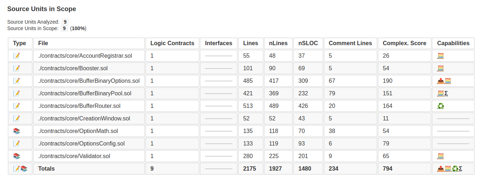

## Documentation

Refer to this [link](https://docs.google.com/document/d/1mgnjQ1n5nbKeSUjqY5av2akqBq_hmQrVAZeD4Gh5Cao/edit)

## Solidity Metrics



## Installation

[Install Brownie](https://eth-brownie.readthedocs.io/en/stable/install.html), if you haven't already.

## Compiling

To build and compile:

```bash
brownie compile
```

## Testing

To run the tests:

```bash
brownie test
```

## Coverage

To get the coverage:

```bash
brownie test --coverage
```

```bash
  contract: AccountRegistrar - 68.8%
    AccountRegistrar.registerAccount - 87.5%
    AccountRegistrar.deregisterAccount - 75.0%
    SignatureChecker.isValidSignatureNow - 50.0%

  contract: Booster - 71.2%
    Booster.getBoostPercentage - 100.0%
    Address.functionCallWithValue - 75.0%
    Booster.buy - 75.0%
    SafeERC20._callOptionalReturn - 75.0%
    Address.verifyCallResult - 37.5%

  contract: BufferBinaryOptions - 61.7%
    BufferBinaryOptions._exercise - 100.0%
    BufferBinaryOptions.createFromRouter - 100.0%
    BufferBinaryOptions.min - 100.0%
    BufferBinaryOptions._getReferralDiscount - 91.7%
    ABDKMath64x64.sqrtu - 87.6%
    BufferBinaryOptions.evaluateParams - 82.5%
    BufferBinaryOptions._processReferralRebate - 81.2%
    ABDKMath64x64.abs - 75.0%
    ABDKMath64x64.add - 75.0%
    ABDKMath64x64.div - 75.0%
    ABDKMath64x64.fromUInt - 75.0%
    ABDKMath64x64.ln - 75.0%
    ABDKMath64x64.mul - 75.0%
    ABDKMath64x64.sqrt - 75.0%
    ABDKMath64x64.sub - 75.0%
    ABDKMath64x64.toUInt - 75.0%
    Address.functionCallWithValue - 75.0%
    OptionMath._N - 75.0%
    SafeERC20._callOptionalReturn - 75.0%
    ABDKMath64x64.exp - 58.3%
    ABDKMath64x64.exp_2 - 52.9%
    BufferBinaryOptions.unlock - 52.8%
    ABDKMath64x64.log_2 - 46.1%
    Address.verifyCallResult - 37.5%
    OptionMath._blackScholesPriceBinary - 29.2%
    BufferBinaryOptions.setIsPaused - 0.0%

  contract: BufferBinaryPool - 35.8%
    BufferBinaryPool.send - 81.2%
    BufferBinaryPool._provide - 80.0%
    BufferBinaryPool.lock - 75.0%
    SafeERC20._callOptionalReturn - 75.0%
    BufferBinaryPool._getUnlockedLiquidity - 45.0%
    Address.verifyCallResult - 37.5%
    BufferBinaryPool._beforeTokenTransfer - 15.0%
    BufferBinaryPool._unlock - 0.0%
    BufferBinaryPool._validateHandler - 0.0%
    BufferBinaryPool._withdraw - 0.0%
    BufferBinaryPool.divCeil - 0.0%
    BufferBinaryPool.setMaxLiquidity - 0.0%
    BufferBinaryPool.shareOf - 0.0%
    BufferBinaryPool.toTokenX - 0.0%
    BufferBinaryPool.transferFrom - 0.0%

  contract: BufferRouter - 70.9%
    Validator.verifyUserTradeParams - 100.0%
    BufferRouter.openTrades - 95.0%
    SignatureChecker.isValidSignatureNow - 87.5%
    Address.functionCallWithValue - 75.0%
    SafeERC20._callOptionalReturn - 75.0%
    BufferRouter.executeOptions - 73.8%
    BufferRouter.verifyTrade - 68.8%
    BufferRouter._validateKeeper - 62.5%
    BufferRouter.approveViaSignature - 62.5%
    BufferRouter.closeAnytime - 61.3%
    Validator.verifyMarketDirection - 50.0%
    Address.verifyCallResult - 37.5%

  contract: CreationWindow - 91.7%
    CreationWindow.isInCreationWindow - 91.7%

  contract: FakeTraderNFT - 52.5%
    ERC721URIStorage._setTokenURI - 75.0%
    FakeTraderNFT.safeMint - 75.0%
    FakeTraderNFT.claim - 41.7%
    ERC721URIStorage.tokenURI - 0.0%

  contract: MarketOIConfig - 100.0%
    MarketOIConfig.getMaxMarketOI - 100.0%

  contract: OptionStorage - 0.0%

  contract: OptionsConfig - 0.0%
    OptionsConfig.setMaxPeriod - 0.0%
    OptionsConfig.setMinPeriod - 0.0%

  contract: PoolOIConfig - 100.0%
    PoolOIConfig.getMaxPoolOI - 100.0%

  contract: PoolOIStorage - 87.5%
    PoolOIStorage.updatePoolOI - 87.5%

  contract: ReferralStorage - 33.3%
    ReferralStorage.registerCode - 75.0%
    ReferralStorage.getTraderReferralInfo - 0.0%
    ReferralStorage.setReferrerTier - 0.0%
```

## Create Metrics

```bash
solidity-code-metrics ./contracts/core/\* --html > metrics.html
```
